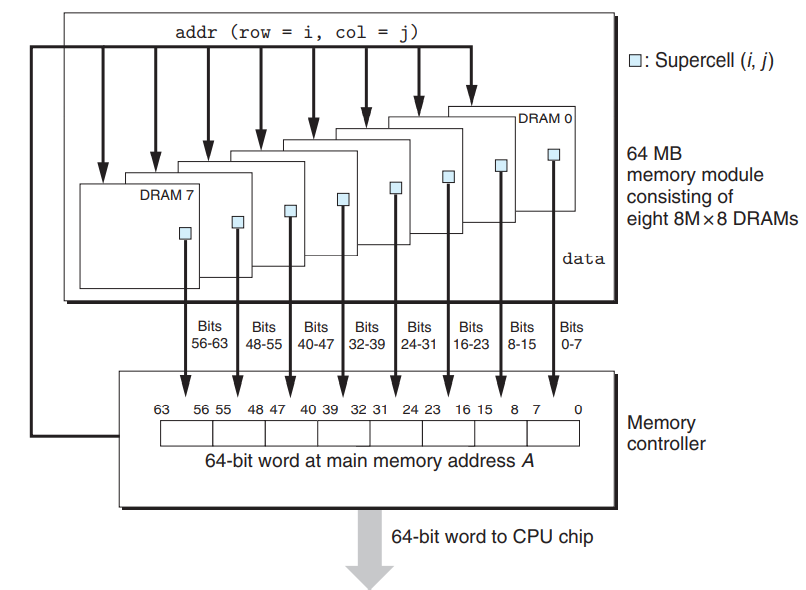
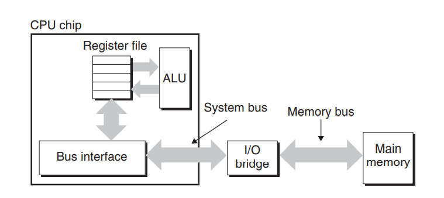
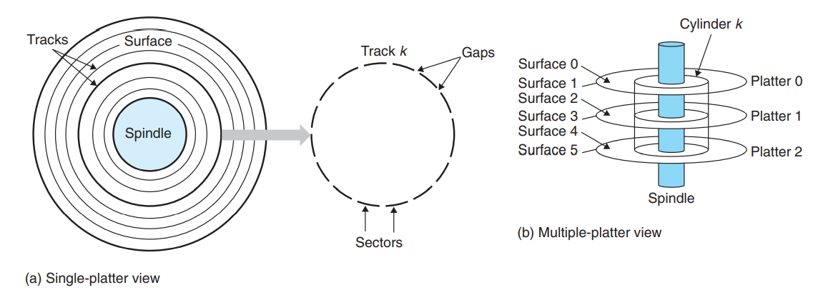
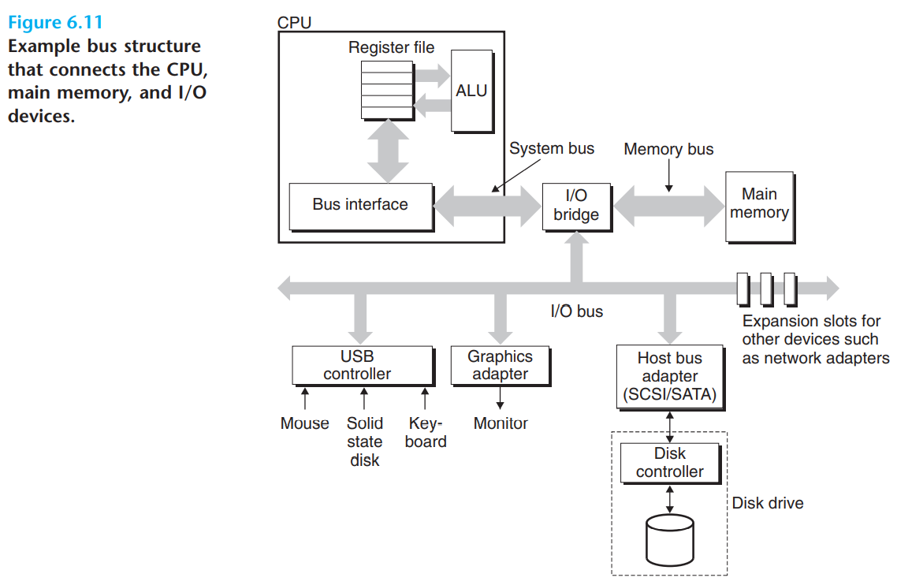

> 既非自顶向下，也非自底向上，基于端对端构建。


+ hard disk drive: 硬盘
+ solid state drive: SSD

访问存储在寄存器上的数据需要1个周期访问，高速缓存上需要4~75个周期，主存上需要上百个时钟周期，磁盘上需要几千万个时钟周期。

Numbers Everyone Should Know

```c
L1 cache reference                           0.5 ns
Branch mispredict                            5   ns
L2 cache reference                           7   ns                      14x L1 cache
Mutex lock/unlock                           25   ns
Main memory reference                      100   ns                      20x L2 cache, 200x L1 cache
Compress 1K bytes with Zippy             3,000   ns        3 us
Send 1K bytes over 1 Gbps network       10,000   ns       10 us
Read 4K randomly from SSD*             150,000   ns      150 us          ~1GB/sec SSD
Read 1 MB sequentially from memory     250,000   ns      250 us
Round trip within same datacenter      500,000   ns      500 us
Read 1 MB sequentially from SSD*     1,000,000   ns    1,000 us    1 ms  ~1GB/sec SSD, 4X memory
Disk seek                           10,000,000   ns   10,000 us   10 ms  20x datacenter roundtrip
Read 1 MB sequentially from disk    20,000,000   ns   20,000 us   20 ms  80x memory, 20X SSD
Send packet CA->Netherlands->CA    150,000,000   ns  150,000 us  150 ms
```

## 1. 随机访问存储器（RAM）

+ **静态SRAM**
  + 位存储方式：单个位存储在一个双稳态的存储器单元中
  + 双稳态指的是只要有电，该电路就能够无限期保持在两个不同的电压状态之一，其余状态均是不稳定的（即亚稳态，任何微小的扰动都会使其偏向某一个状态，且一旦进入某一稳态就无法恢复到亚稳态）
+ **动态DRAM**
  + 位存储方式：单个位存储为对一个电容的充电。每个单元由1个电容和一个访问晶体管构成，因此DRAM可以制造得非常密集
  + 每个DRAM单元很容易漏电（一般10~100ms内就会失去电荷），因此内存系统需要周期性从DRAM读出数据位，然后重写以刷新内存中的每一位。

SRAM一般比DRAM快一个数量级。

||每位晶体管数目|相对访问时间|持续的？|敏感的|相对花费|应用|
|---|---|---|---|---|---|---|
|SRAM|6/8个晶体管|1x|是|否|1000x|高速缓存|
|DRAM|1个晶体管1个电容|10x|否|是|1x|主存、framebuffer|

### 1.1. DRAM

DRAM芯片中的每w(位/个单元)组成一个超单元，若共有d个超单元，则DRAM记作$d \star w$。访问DRAM芯片时，超单元被构建成r行c列的2维数组，即$r*c=w$。例如，一个16x8（16个超单元，每个超单元8位）的DRAM，若r和c均为2，则有如下示意图：


如图，内存控制器电路能够一次从内存中读取w位，或者写入w位（即一个超单元的位数）。为了决定超单元的位置，通过一个$log_2^r$位的地址线分两次传递行地址（Row Access Strobe，RAS）和列地址（Column Access Strobe，CAS）。

具体而言，当传递行地址后，DRAM会将对应行的超单元读取到内部的行缓冲区中，之后当收到列地址后，会从行缓冲区获取对应超单元并返回。

多个上述DRAM芯片可以构成一个内存模块，下图使用了8个8Mx8的DRAM芯片，共能存储64MB。

当要读/写一个内存地址A，内存控制器会计算A对应的行号和列号，接着将$(i, j)$发送给内存模块。内存模块进一步广播行地址和列地址到每一个DRAM芯片，每个DRAM芯片贡献一个**字节/8 bits**，最终组成8字节。



### 1.2. DRAM的演进

+ **Fast Page Mode DRAM，FPM DRAM**：传统的DRAM根据行地址读取一行，之后根据列地址读取单个超单元后会抛弃同一行的其它超单元。FPM DRAM允许对同一行的超单元的访问可以直接从行缓存获取。
+ **Extended Data Out DRAM，EDO DRAM**
+ **SDRAM**：同步DRAM使用和驱动内存控制器相同的外部时钟信号的上升沿取代异步信号，比异步存储器更快
+ **Double Data-Rate Synchronization DRAM，DDR SDRAM**：对SDRAM的增强，通过使用两个时钟沿作为控制信号让访问DRAM的速度翻倍。不同类型的DDR SDRAM根据预取缓冲区的大小分类：DDR（2位），DDR2（4位），DDR3（8位）。

### 1.3. 主存访问



I/O Bridge承担了信号翻译的任务，即将系统总线上的信号翻译为内存总线、IO总线上的信号。其内部包括了内存控制器。

**内存读事务**

`movq A, %rax`

+ CPU通过总线接口将地址A放在总线上
+ IO桥转换信号，内存模块获取信号读取数据并将数据放在总线上
+ IO桥转换信号，CPU通过总线接口读取数据存入寄存器

## 2. 磁盘存储

磁盘读信息为**毫秒级别**，比从DRAM上读取慢了10万倍（即DRAM上是百纳秒级别），而比SRAM上读取慢了100万倍。（即SRAM上是几到几十纳秒级别）

### 2.1. 磁盘基本参数

+ **盘片(platter)**：每个盘片有两个表面(surface)，围绕着中央的的主轴(spindle)以固定速率旋转（一般为5400-15000转每分钟，Revolution Per Minute, RPM）。磁盘一般包含一个或多个盘片。
+ **磁道(track)**: 磁道是一个每个表面上的一组同心圆，每个磁道被划分为一组**扇区(sector)**，每个扇区包含相同数据位(一般512字节)，扇区间包含不存储数据的间隙，间隙内是标识扇区的格式化位。
+ **柱面(cylinder)**: 柱面是所有盘片上到主轴距离相等的磁道的集合。



多区记录(multiple zone recording)技术：柱面集合被划分为不相交的子集合，称为记录区。每个区包含连续的柱面，同一个区每个磁道中的扇区数相同，由最内部的磁道能包含的扇区数决定。

$磁盘容量 = \frac{字节数}{扇区} * \frac{平均扇区数}{磁道} * \frac{磁道数}{表面} * \frac{表面数}{盘片} * \frac{盘片数}{磁盘}$

制造商的1GB=$10^9$字节，1TB=$10^{12}$字节。

### 2.2. 磁盘读写

+ 磁盘通过读/写头读写数据
  + 每个盘面上都有一个独立的读写头，多个盘面上的读写头连接到 **传动臂(actuator arm)** 上垂直排列统一移动
+ **寻道时间**: 定位读写头到磁道上的时间，平均寻道时间通常为3-9ms，最大寻道时间为20ms
+ **旋转时间**: 驱动器等待目标扇区第一个位到达读/写头下的时间。最坏情况下为旋转一圈的时间，即$\frac{1}{RPM}*\frac{60s}{1min}$
  + $\frac{1}{RPM}$表示旋转1圈所用时间，单位为分钟
+ **传送时间**: 读写头读取目标扇区数据的时间。则读取一个扇区的平均时间为$\frac{1}{RPM}*\frac{1}{磁道的平均扇区数}*\frac{60s}{1min}$

示例：旋转速率7200RPM，$T_{avg\;seek}$9ms，每条磁道平均扇区数400。

+ 平均旋转延迟: 一般的旋转一圈的时间，即$\frac{1}{7200} * 60 * 1000 * \frac{1}{2} = 4ms$
+ 平均传送时间: $8ms * \frac{1}{400} = 0.02ms$
+ 整个访问时间: $4ms + 0.02ms + 9ms = 13.02ms$

**特点**

+ 传送时间可以忽略
+ 寻道时间和旋转延迟较长
+ **寻道时间和旋转延迟大致相等，将寻道时间乘2是估计磁盘访问时间的一种方法**

### 2.3. 逻辑磁盘块

从操作系统的角度，磁盘为一个B个扇区大小的逻辑块序列，编号为0，1，...，B-1。磁盘中封装了磁盘控制器，维护着逻辑块号和实际的物理扇区间的映射关系。

操作系统发出的逻辑扇区号的命令，控制器会翻译为（盘面，磁道，扇区）的三元组，唯一标识了一个物理扇区。

### 2.4. IO总线与磁盘访问

内存总线和系统总线和CPU相关，但是IO总线和CPU无直接关系。IO总线相比内存总线和系统总线最慢，但是可以容纳很多第三方IO设备。

+ **通用串行总线**（Universal Serial Bus, USB）: 包括键盘、鼠标、调制解调器、打印机等等。
+ **图形卡**
+ **host bus adapter**：通过由*host bus inteface*定义的通信协议将一个或多个磁盘连接到IO总线。两个常用的接口是
  + **SCSI**: 较快，但是更贵，SCSI/SAS需要专用的控制卡，或者主板另外集成控制芯片。外设可以并行访问。**a SCSI host bus adapter (often called a SCSI controller) can support multiple disk drives.**
  + **SATA**: SATA一般由主板南桥/ICH芯片直接集成控制器，点对点访问。**can only support one drive.**



**磁盘访问**

CPU通过内存映射IO向磁盘发送IO请求，之后磁盘控制器将逻辑块号翻译为扇区地址，读取扇区内容，然后通过DMA将内容直接传送到主存。DMA完成后，磁盘控制器发送中断信号到CPU的一个外部引脚上以通知CPU。

## 3. 固态硬盘（SSD）

+ 闪存芯片：相对于机械驱动器
+ 闪存翻译层：相对于磁盘控制器

一个闪存由**B个块**的序列组成，**每个块由P个页组成**，页的大小通常是512字节 ~ 4K字节，块是由32 ~ 128页组成，块的大小为16K字节 ~ 512K字节。

+ 数据**以页为单位进行读写**。
+ 一个块被擦除后，才能写这个块中的页。块的寿命一般为100,000次写。

平均读写性能为几十**微妙**级别。

+ 随机写很慢：
  + 擦除块需要很长时间，1ms。
  + 若写操作涉及**修改**已经包含有数据的页，则需要首先将该页复制到一个新的块，然后才能对其进行写操作。

## 4. 存储技术趋势

+ 不同的存储技术有不同的价格和性能折中
+ 不同的存储技术的价格和性能以不同的速率变化
+ DRAM和磁盘的性能提升滞后于CPU性能的提升

现代计算机尝试使用SRAM弥补处理器和内存之间的差距。
