> 在计算机科学中只有两件难事：缓存失效和命名。

## 1. 局部性原理

+ 时间局部性: 程序倾向于引用最近引用过的数据。
+ 空间局部性: 程序倾向于引用最近引用过的数据附近的数据。

量化评价局部性的一些原则:

+ **重复引用相同变量**的程序有良好的时间局部性。
+ 对数组以步长为k的模式进行引用时，k越小，空间局部性越好。
+ 对取指令而言，循环有好的时间和空间局部性，**循环体越小**，循环迭代次数越多，局部性越好。

## 2. 存储器层次结构

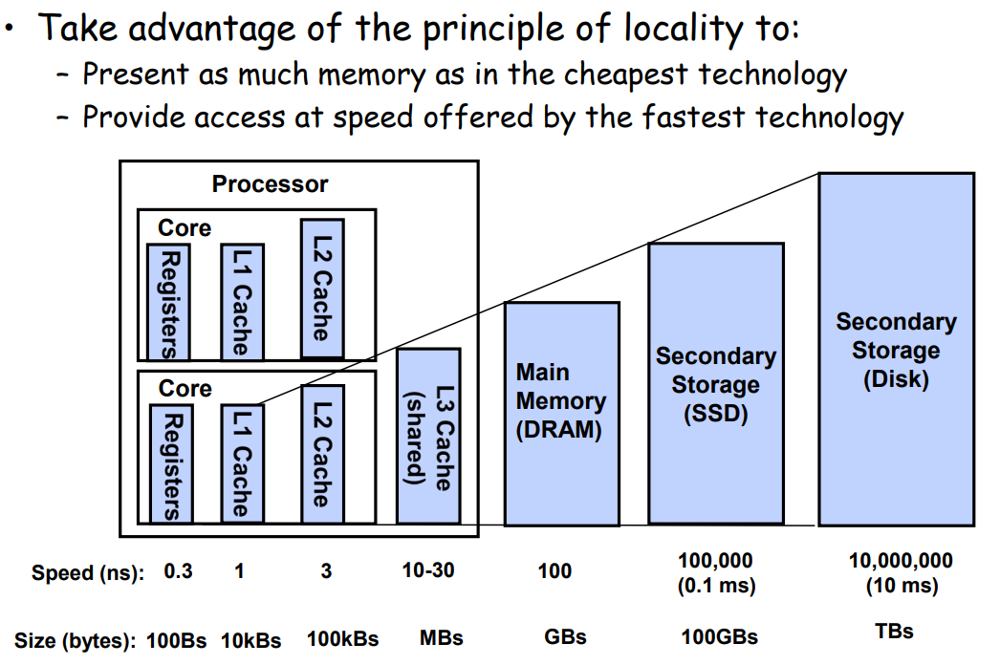

利用局部性原理组织存储器结构以期能够

+ 提供和最低成本存储相同数量级大小的空间
+ 提供和最高成本存储相同数量级大小的访问速度

基本思想: 第k层存储作为第k+1层存储的缓存。相邻两层之间使用固定的块大小作为传输单元。

+ 缓存命中
+ 缓存未命中: 需要从k+1层取出对应的块
  + 第k层未满
  + 第k层已经满了: **replace/evict** a **victim block**
+ **缓存未命中的种类**
  + **Cold (compulsory) miss**: 对数据第一次引用时，缓存为空，一定会不命中
  + **Capacity miss**: 工作集(**working set**)比第k层缓存大
  + **Conflict miss**: 第k层缓存的空间足够放下工作集但是多个数据被映射到第k层的同一个地址块上
+ 缓存管理
  + 在每一层上，某种形式的逻辑需要管理内存，或是软件或是硬件
  + L1, L2, L3缓存: 硬件逻辑
  + DRAM: 作为对磁盘上数据块的缓存，操作系统软件和地址翻译硬件共同管理
  + AFS: 本地磁盘是缓存，由本地机器上的AFS客户端管理

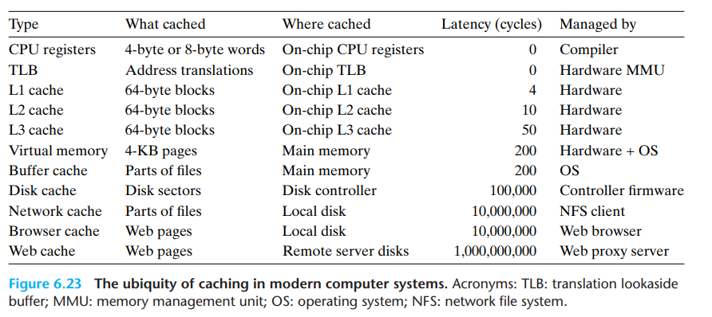

+ 注意到cache缓存通常块大小是64字节
+ L1 cache访问需要4个时钟周期
+ L2 cache访问需要10个时钟周期
+ L3 cache访问需要50个时钟周期

## 3. Cache memories

假设每个内存地址为$m$位。高速缓存被组织成$S = 2^s$个高速缓存组(**cache set**)，每个组包括$E$个高速缓存行。每行包括

+ $B = 2^b$字节的数据块
+ 有效位
+ $t = m - s - b$个标记位

因此，高速缓存的结构可以由四元组`(S, E, B, m)`描述。高速缓存的大小$C$指的是所有块大小之和，不包括有效位和tag，即$C = S * E * B$。

同时$m$位的地址被划分为三个部分如下所示

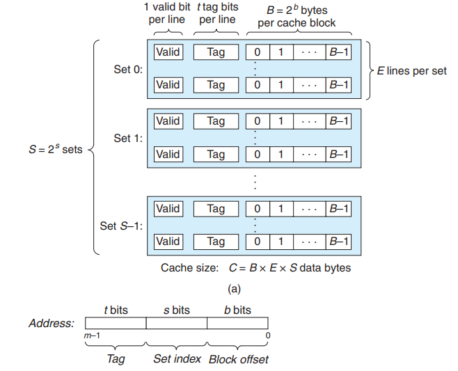

### 3.1. 直接映射

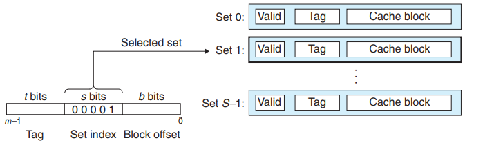

+ 直接映射: **每个组只有一行**，$E = 1$
  + 组选择位(**set index**): 唯一映射到一个缓存行
+ 组选择: 通过$S$位进行选择
+ 行匹配: 通过$t$位进行匹配
+ 字抽取: 通过$m - s - t$位的值进行偏移

**不命中**

+ 可能会出现抖动（thrash）

### 3.2. 组相联

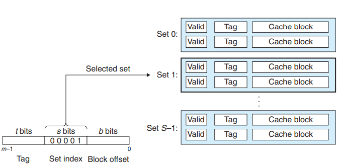

+ 组相联: 每个组有$1 < E < \frac{C}{B}$行
  + 相联存储器指的是（key，value）存储。组相联指的是多个组的相联存储器。
+ 组选择: 通过$S$位进行选择
+ 行匹配: $t$位（和标志位）作为键，相当于一个小的相联存储，块作为值进行匹配
+ 字抽取

**不命中**

+ 使用替换算法
  + LFU: 最不常用，即最近一段时间，引用次数最少
  + LRU: 最近最少使用，即最近一段时间，引用时间距离最远
+ 性能损失
  + 替换策略需要额外的时间和设备，但是越偏向存储层次结构的底层，一次不命中的开销远高于这种额外的时间和设备。

### 3.3. 全相联

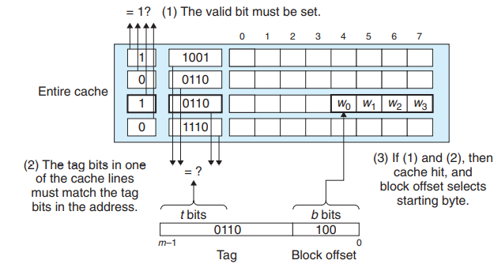

+ 全相联: 只有1个组，即$S = 1, s = 0$，行数$E = \frac{C}{B}$
+ 由于需要并行匹配多个缓存行，全相联只适合做小的高速缓存，例如TLB。

### 3.4. 写缓存

**写命中**

+ 直写: 直接写入下一层
+ 写回: 需要额外的修改位

**写不命中**

+ 写分配(write-allocate): 先读下一层的块到当前层，然后写入当前层
  + 和写回搭配
  + 需要额外的一次读操作
+ 非写分配(not write-allocate): 直接写入下一层
  + 和直写搭配

### 3.5. 性能参数

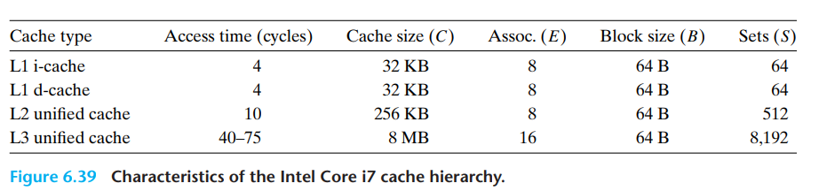

+ **miss rate**: 不命中数量 / 引用数量
+ **hit rate**: 1 - miss rate
+ **hit time**: 从高速缓存传送一个字到CPU的时间，组选择、行选择和字选择的时间之和。
+ **miss penalty**: 由于不命中所需要的额外的时间

一些tradeoff

+ 高速缓存大小
  + 大：命中率大，命中时间（物理限制）长
+ 块大小
  + 大: 局部性容易利用，命中率容易变大，行数少
+ 相联度
  + 高: 命中率大, 命中时间长，由于更复杂，不命中处罚变大
  + 整体上而言，命中时间占比大而不命中处罚占比小，但是单次命中、不命中时间都变长
  + **离CPU近的高速缓存系统，因为命中、不命中相差不大，使用较低的相联度**
+ 写策略
  + 直写可以使用写缓冲区，且非写分配在高层导致的读未命中惩罚不大。
  + 写回减少总线传输，允许更多的DMA
  + **越底层，写回越多**

## 4. 高速缓存与性能

**存储系统读性能测试**

+ **读吞吐率/读带宽**: 一般用MB每秒表示。

下面是测试内存系统读性能的函数

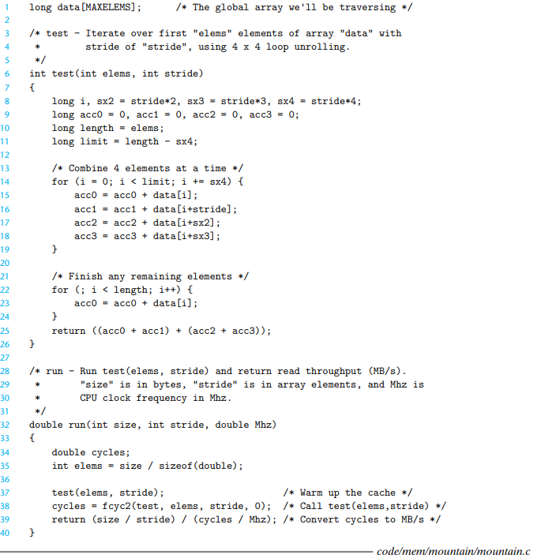

+ size: 读取元素的总字节数
+ elems: 读取的元素数目
+ stride: 读取的两个元素间的步长
+ 首先预热（因此有时间局部性），然后通过`fcyc2`测试执行周期数

**内存山**

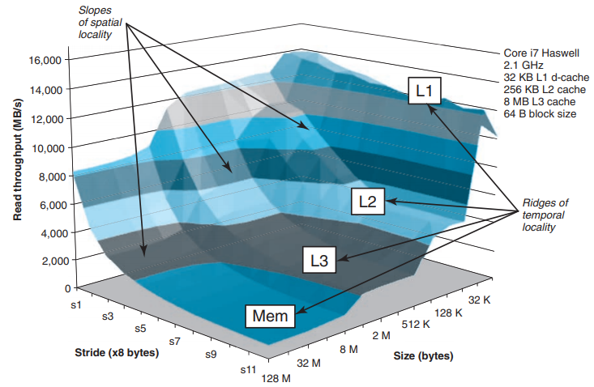

+ 工作集越小，时间局部性越好
+ 步长越小，空间局部性越好

### 4.1. 综合：重排循环对矩阵乘法效率的影响

+ 矩阵乘法中: $C = A_{ik} * B_{kj}$
+ 按最内层循环分类，有三种遍历计算方式
  + 对i遍历: 内层遍历A的列和C的列
  + 对k遍历: 内层同时遍历A的行和B的列
  + 对j遍历: 内层遍历B的行和C的行
+ 假设
  + 数组都是double类型的
  + 只有一个高速缓存，块大小为32字节
  + 数组大小n很大，一个高速缓存行装不下
  + 编译器将局部变量存储在寄存器中，无加载或存储指令的开销

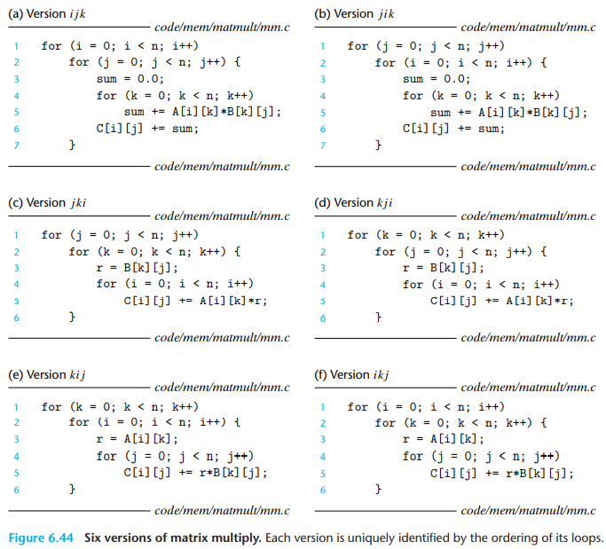

性能统计如下

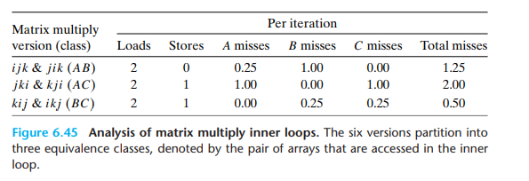
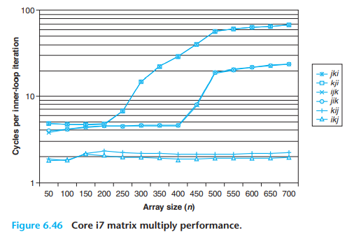

+ 随着n的增大，最坏性能和最好性能相差了40倍
+ 该案例中和内存访问总数相比，缓存命中率是一个更好的指标。虽然按k迭代的版本内存访问次数减少，但是性能仍比按j迭代的慢
+ 随着n的增大，按j迭代的版本下性能变化不大，这是由于core i7**预取硬件能够识别步长为1的访问模式**

**矩阵分块操作**

+ 假设
  + cache block大小为8个doubles
  + cache size C << n

对于按k遍历的情况，首次迭代$n/8 + n$次未命中，之后的情况类似。总未命中数为 $9n/8n^2 = (9/8)n^3$

对于分块运算

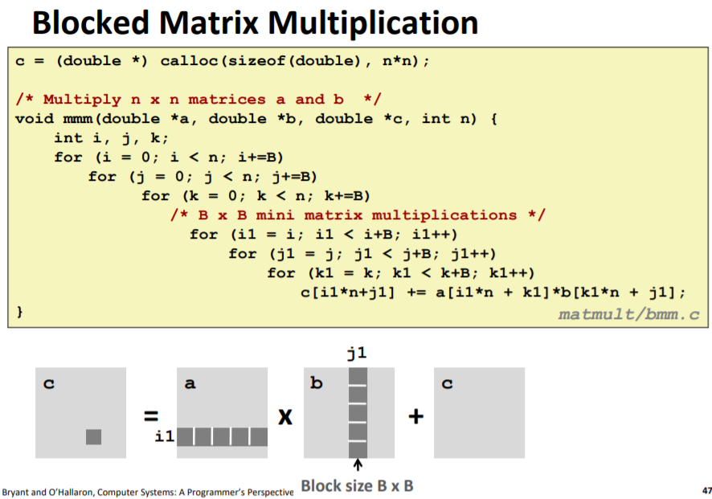

+ $3B^2 < C$
  + **让2个输入块和1个输出块都能放入缓存中**
+ 单个矩阵块有$B^2/8$次未命中
+ 首次迭代有$2*\frac{n}{B}*\frac{B^2}{8}$次未命中（内循环遍历一次的块数乘以每个块的为命中数）
+ 总未命中数为$nB/4 * (n/B)^2 = n^3/(4B)$

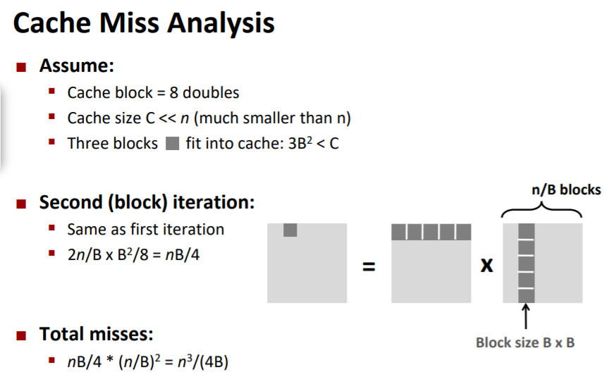

**小结**

+ 无分块: $(9/8)n^3$次未命中
+ 分块: $(1/(4B))n^3$次未命中 
+ 性能差异的原因
  + 输入数据为$3n^2$，计算总共需要$2n^3$次（对k遍历，两次内存load操作，无store操作），因此常数因子的上限为2。每一个数组元素被访问了O(n)次，因此幂次3不变。
